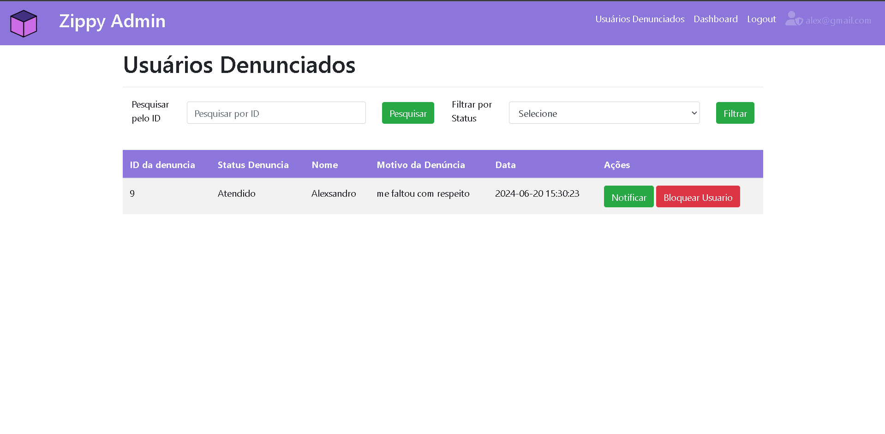
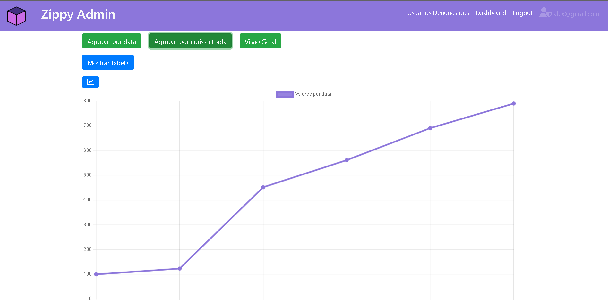

# Zippy


**Zippy** é uma plataforma que conecta compradores e viajantes em todo o mundo, facilitando a obtenção dos melhores preços e prazos de entrega para produtos desejados. Através do Zippy, compradores podem encontrar ofertas vantajosas e viajantes podem gerar renda extra transportando esses produtos durante seus trajetos de viagem.

### Objetivo

O principal objetivo do Zippy é democratizar o acesso a produtos e serviços, permitindo que compradores encontrem os melhores preços para os produtos que desejam e que viajantes ganhem uma renda extra ao transportar esses produtos durante suas viagens.

### Tecnologias Utilizadas

* **Frontend:** HTML, CSS, JavaScript, AJAX, Bootstrap, jQuery
* **Backend:** PHP
* **Banco de Dados:** MySQL com PHPMyAdmin
* **Controle de Versão:** Git

### Instalação

#### Clonando o Repositório

```bash
git clone https://github.com/AlexavierDev/Zippy-TCC.git
```

#### Dependências Necessárias

* Composer
* PHPMailer

#### Instalando as Dependências

**Composer**

Baixe o instalador do Composer em [https://getcomposer.org/download/](https://getcomposer.org/download/).

**PHPMailer**

```bash
composer require phpmailer/phpmailer
```

#### Configurando o Ambiente Local

Para executar o projeto localmente:

1. Mova o projeto para um servidor web como WAMP ou XAMPP.
2. Coloque o projeto no diretório `www/`.
3. Importe o banco de dados utilizando o PHPMyAdmin, utilizando o arquivo `.sql` fornecido.
4. Acesse o projeto pelo navegador utilizando a URL `localhost/seu-diretorio`.

### Uso

O Zippy oferece diversas funcionalidades para compradores e viajantes:

**Compradores:**

* **Criar pedidos de produtos desejados:** Encontre o produto que você procura e faça um pedido, especificando quantidade, localização e orçamento.
* **Listar pedidos disponíveis dentro dos trajetos de viagem:** Visualize os pedidos que estão dentro dos trajetos de viagem de interesse e entre em contato com os viajantes.
* **Iniciar conversas entre viajantes e compradores:** Negocie o transporte do produto com o viajante, definindo detalhes como preço, prazo de entrega e local de entrega.
* **Recuperar senha e receber notificações por e-mail:** Mantenha sua conta segura e atualizada com notificações sobre o status dos seus pedidos.

**Viajantes:**

* **Listar pedidos disponíveis dentro dos seus trajetos de viagem:** Encontre pedidos que se encaixam no seu trajeto de viagem e ofereça seus serviços de transporte.
* **Iniciar conversas entre viajantes e compradores:** Negocie o transporte do produto com o comprador, definindo detalhes como preço, prazo de entrega e local de entrega.
* **Ganhar renda extra:** Transporte produtos durante suas viagens e receba pagamentos por seus serviços.

## Painel Administrativo e Dashboard de Transações



**Legenda:** Esta imagem mostra a tela inicial do painel administrativo do Zippy, onde os administradores podem visualizar e gerenciar diversos aspectos da plataforma.

O Zippy oferece um painel administrativo completo para gerenciamento avançado da plataforma, permitindo que administradores visualizem, gerenciem e analisem diversos aspectos da plataforma.

**Funcionalidades do Painel Administrativo:**

* **Gerenciamento de Usuários:**
    * Visualize e gerencie todos os usuários da plataforma, incluindo compradores e viajantes.
    * Bloqueie e desbloqueie usuários, se necessário.
    * Envie notificações diretas para usuários, informando-os sobre ações tomadas ou alertas importantes.
* **Gerenciamento de Denúncias:**
    * Visualize e gerencie todas as denúncias de usuários feitas na plataforma.
    * Investigue as denúncias e tome as medidas cabíveis, como bloquear usuários ou remover conteúdo.
    * Mantenha um ambiente seguro e positivo para todos os usuários da plataforma.
* **Dashboard de Transações:**
    * Acesse um dashboard detalhado com estatísticas e gráficos sobre as transações da plataforma.
    * Visualize informações como número de pedidos, valor total das transações, países e cidades mais envolvidos, e muito mais.
    * Utilize os dados para monitorar o crescimento da plataforma, identificar tendências e tomar decisões estratégicas.

**Acesso ao Painel Administrativo:**

* O painel administrativo pode ser acessado através da URL: `[localhost/seu-diretorio/admin](http://localhost/seu-diretorio/admin)`
* Utilize suas credenciais de administrador para fazer login.

**Dashboard de Transações:**



* O dashboard de transações fornece uma visão geral abrangente das atividades da plataforma.
* Os gráficos e estatísticas detalhadas permitem que administradores monitorem o desempenho da plataforma, identifiquem oportunidades de crescimento e tomem decisões informadas para otimizar as operações.


### Autor

Desenvolvido por Alexsandro.

### Licença

Este projeto está licenciado sob a [Licença MIT](https://opensource.org/licenses/MIT).
